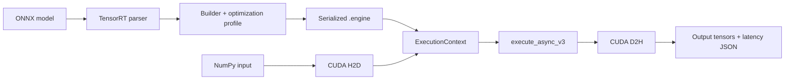

# TensorRT Real-Time Inference Runtime

A compact NVIDIA inference runtime that turns an ONNX model into a serialized TensorRT engine and executes it with explicit CUDA memory management and asynchronous streams.

## What it demonstrates

- TensorRT network parsing and engine serialization
- FP32 / FP16 engine builds
- Dynamic input shapes through optimization profiles
- TensorRT 10+ named-tensor API (`set_tensor_address` + `execute_async_v3`)
- Explicit CUDA device allocation, H2D/D2H copies, and stream synchronization
- Warm-up + repeatable latency benchmarking with JSON output
- CPU CI for syntax checks; GPU execution on NVIDIA hosts
- Jenkins and Google Cloud Build configs for reproducible builds

## Architecture



## Build an engine

```bash
python trt_infer.py build model.onnx model.engine --fp16 --input-shape 1,3,224,224
```

For a model with dynamic dimensions, `--input-shape` is used as the optimization shape. The script creates conservative min/max profiles around it.

## Benchmark

```bash
python trt_infer.py bench model.engine --input-shape 1,3,224,224 --warmup 10 --iterations 100
```

Example output schema:

```json
{
  "iterations": 100,
  "mean_ms": "... measured on your GPU ...",
  "p50_ms": "...",
  "p95_ms": "...",
  "throughput_per_s": "..."
}
```

No benchmark numbers are hard-coded in this repository.

## Requirements

- NVIDIA GPU + recent driver
- TensorRT 10+
- CUDA runtime
- Python 3.10+
- NumPy
- `cuda-python`

TensorRT wheels/system packages depend on the CUDA/TensorRT image you use, so the requirements file keeps TensorRT as an environment-level dependency.

## CI / cloud

- `Jenkinsfile` runs Python syntax checks and imports where available.
- `cloudbuild.yaml` builds a container image on Google Cloud Build. GPU execution should be done on a GPU-enabled Compute Engine/GKE worker.

## Why this project exists

Framework-level inference hides several systems decisions: engine construction, shape profiles, device memory, stream ordering, and synchronization. This repo makes those pieces explicit so the hot path is inspectable end-to-end.

## License

MIT
